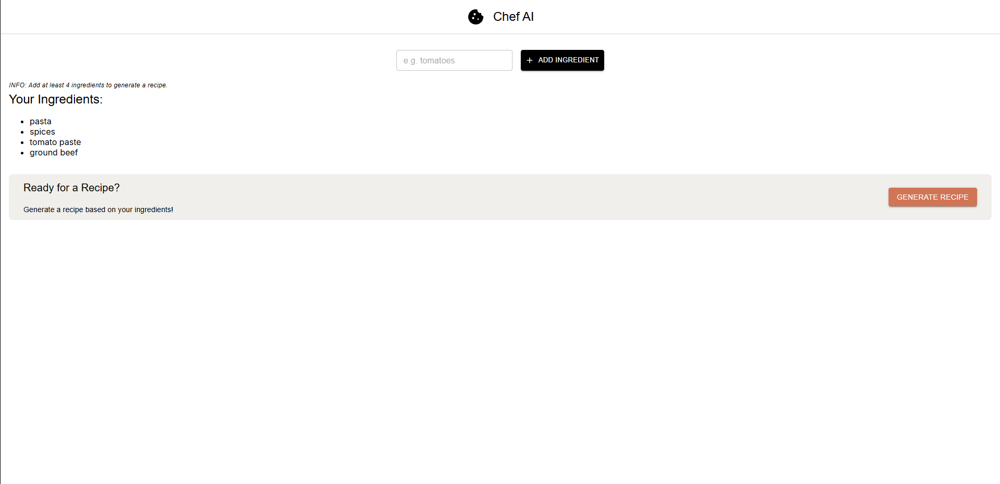
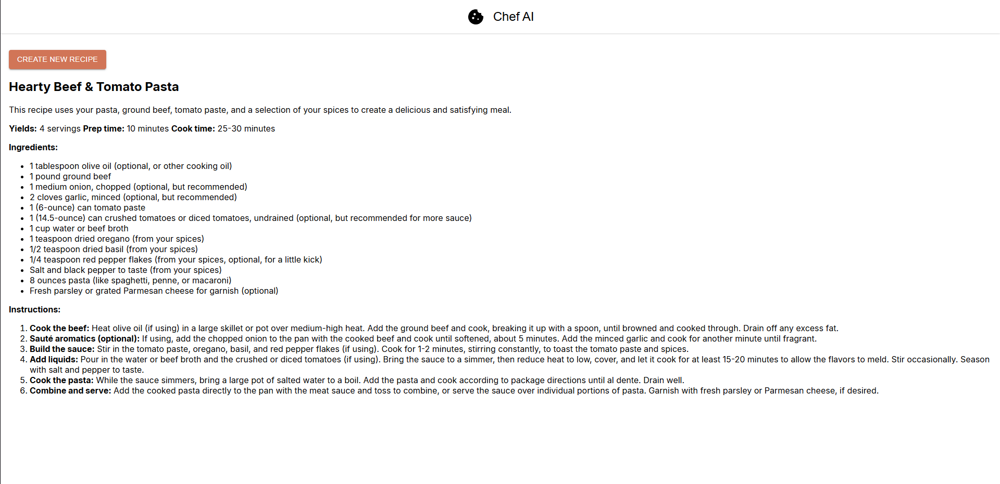

# ChefAI

ChefAI is a web application that generates personalized recipe recommendations and cooking instructions based on available ingredients. Enter the ingredients you have on hand, and the app will use AI to suggest delicious recipes you can make.

## Example

Below are example screenshot of the ChefAI app:




## Features

- **Enter available ingredients** from your kitchen
- AI-powered recipe generation based on your ingredients
- Step-by-step cooking instructions
- Estimated cooking time

## How It Works

1. Enter the ingredients you have available in the input field.
2. Click **Generate Recipe**.
3. The app uses AI to analyze your ingredients and generate personalized recipe suggestions.
4. View detailed cooking instructions and ingredient measurements.

## Getting Started

### Prerequisites

- [Node.js](https://nodejs.org/) (v18 or higher recommended)
- npm or yarn package manager
- AI API key (e.g., OpenAI, Anthropic Claude, or Google Gemini)

### Installation

1. Clone the repository:
   ```bash
   git clone https://github.com/yourusername/chef-ai.git
   cd chef-ai
   ```
2. Install dependencies:
   ```bash
   npm install
   ```
3. Configure your API key in `.env`:
   ```env
   VITE_AI_API_KEY=YOUR_API_KEY_HERE
   ```

### Development Server

Start the local development server:

```bash
npm run dev
```

Open your browser at [http://localhost:5173/](http://localhost:5173/).

### Building

To build the project for production:

```bash
npm run build
```

## Technology Stack

- **React** - UI framework
- **TypeScript** - Type-safe development
- **Vite** - Fast build tool and dev server
- **React Compiler** - Optimized React performance

## Disclaimer

This application is for educational and entertainment purposes only. **Always verify recipes and cooking instructions.** Be mindful of food allergies and dietary restrictions.

## License

MIT

---

For more information on using Vite with React, visit the [Vite Documentation](https://vite.dev/).
