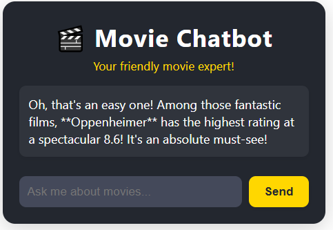

# MovieChatbot

MovieChatbot is a conversational web application that helps users discover and learn about movies using AI. Ask questions about movies, get recommendations, and explore film details—all powered by Gemini AI and Supabase.

## Example

Below is an example screenshot of the MovieChatbot app:



## Features

- Ask natural language questions about movies
- AI-powered answers and recommendations
- Context-aware responses using ONLY movie data
- Clean, modern chatbot interface

## Development server

To start a local development server, run:

```bash
ng serve
```

Once the server is running, open your browser and navigate to `http://localhost:4200/`. The application will automatically reload whenever you modify any of the source files.

## Code scaffolding

Angular CLI includes powerful code scaffolding tools. To generate a new component, run:

```bash
ng generate component component-name
```

For a complete list of available schematics (such as `components`, `directives`, or `pipes`), run:

```bash
ng generate --help
```

## Building

To build the project run:

```bash
ng build
```

This will compile your project and store the build artifacts in the `dist/` directory. By default, the production build optimizes your application for performance and speed.

## Running unit tests

To execute unit tests with the [Karma](https://karma-runner.github.io) test runner, use the following command:

```bash
ng test
```

## Additional Resources

For more information on using the Angular CLI, including detailed command references, visit the [Angular CLI Overview and Command Reference](https://angular.dev/tools/cli) page.
