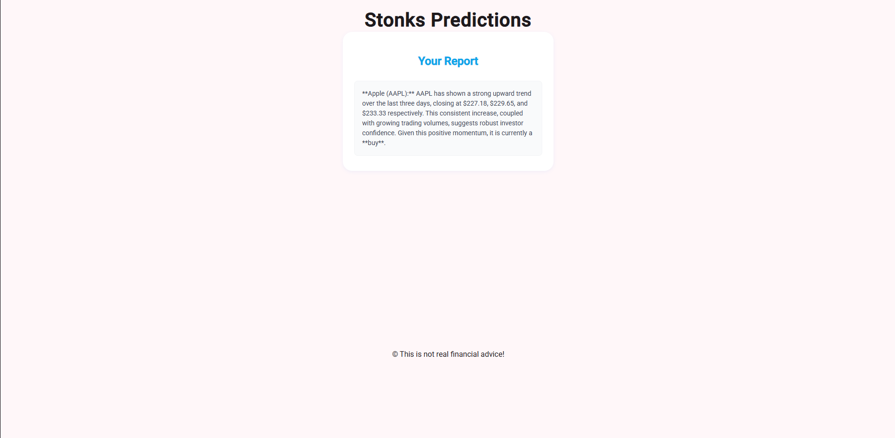

# StonkPredictor

StonkPredictor is a web application that generates stock predictions and actionable insights for user-selected stocks. Enter a stock ticker, and the app will fetch the last 3 days of price data, then use Google's Gemini AI to analyze the stock and provide a concise recommendation: **Buy**, **Sell**, or **Hold**.

## Example

Below is an example screenshot of the StonkPredictor app:



## Features

- **Add up to 3 stock tickers** (e.g., MSFT, AAPL, TSLA)
- Fetches the previous 3 days of price data for each ticker
- Uses Gemini AI to analyze stock performance and trends
- Generates a brief, actionable report for each stock

## How It Works

1. Enter one or more stock tickers in the input field.
2. Click **Generate Report**.
3. The app fetches recent price data for each ticker from the Polygon API.
4. Gemini AI analyzes the data and returns a summary with a **Buy**, **Sell**, or **Hold** recommendation.

## Getting Started

### Prerequisites

- [Node.js](https://nodejs.org/) (v18 or higher recommended)
- [Angular CLI](https://angular.dev/tools/cli)
- Polygon API key (for stock data)
- Gemini API key (for AI analysis)

### Installation

1. Clone the repository:
   ```bash
   git clone https://github.com/yourusername/stonk-predictor.git
   cd stonk-predictor
   ```
2. Install dependencies:
   ```bash
   npm install
   ```
3. Configure your API keys in `src/environments/environment.ts`:
   ```ts
   export const environment = {
     polygonApiKey: "YOUR_POLYGON_API_KEY",
     geminiApiKey: "YOUR_GEMINI_API_KEY",
   };
   ```

### Development Server

Start the local development server:

```bash
ng serve
```

Open your browser at [http://localhost:4200/](http://localhost:4200/).

### Building

To build the project for production:

```bash
ng build
```

## Disclaimer

This application is for educational and entertainment purposes only. **It does not provide real financial advice.** Always do your own research before making investment decisions.

## License

MIT

---

For more information on using the Angular CLI, visit the [Angular CLI Overview and Command Reference](https://angular.dev/tools/cli).
