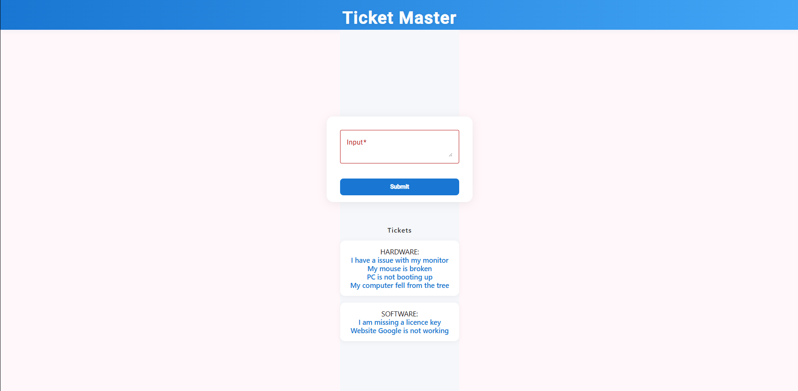

# TicketMaster

TicketMaster is a web application that helps organize and categorize support tickets using AI. Users enter a ticket description, and Gemini AI analyzes the text to determine the appropriate category. The app then saves the ticket and its category in a map for easy tracking and management.

## Example

Below is an example screenshot of the TicketMaster app:



## Features

- Enter support ticket descriptions
- Gemini AI automatically categorizes each ticket based on its description
- Tickets and their categories are stored in a map for quick lookup and organization

## Development server

To start a local development server, run:

```bash
ng serve
```

Once the server is running, open your browser and navigate to `http://localhost:4200/`. The application will automatically reload whenever you modify any of the source files.

## Code scaffolding

Angular CLI includes powerful code scaffolding tools. To generate a new component, run:

```bash
ng generate component component-name
```

For a complete list of available schematics (such as `components`, `directives`, or `pipes`), run:

```bash
ng generate --help
```

## Building

To build the project run:

```bash
ng build
```

This will compile your project and store the build artifacts in the `dist/` directory. By default, the production build optimizes your application for performance and speed.

## Running unit tests

To execute unit tests with the [Karma](https://karma-runner.github.io) test runner, use the following command:

```bash
ng test
```

## Additional Resources

For more information on using the Angular CLI, including detailed command references, visit the [Angular CLI Overview and Command Reference](https://angular.dev/tools/cli) page.
